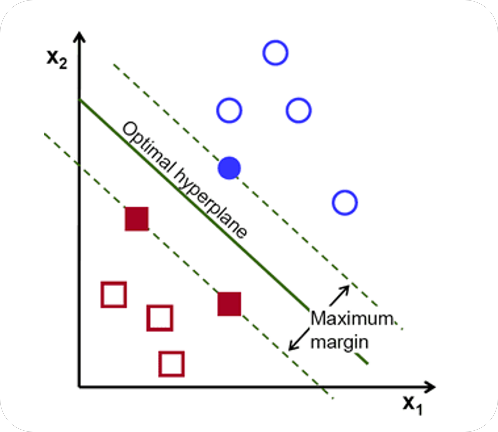
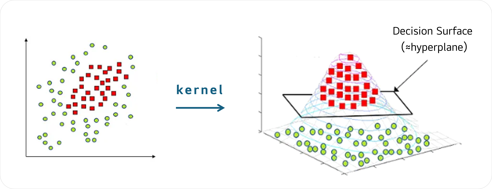

# SVM 커널 비교와 최적화

<br>

손글씨 숫자 이미지(Digits dataset)를 대상으로 SVM 분류기를 적용하고 Linear, RBF, Sigmoid 커널의 성능을 비교한다.

GridSearchCV를 통해 하이퍼파라미터를 최적화하고

앙상블 학습(Voting, Gradient Boosting), PCA 차원 축소 등의 기법을 적용해 정확도 변화를 관찰한다.

<br>

### 프로젝트 기간

📆 2023.05 ~ 2023.06


### - 목차 -


<br>

## ◈ SVM (Support Vector Machine)

• 1990년대 초반에 제안된 **지도학습** 기반 분류 알고리즘

• 핵심 아이디어는 데이터를 가장 잘 구분하는 **결정 경계**(초평면, hyperplane)를 찾는 것으로

• 이때 클래스 간 간격(**margin**)을 최대로 확보하는 경계를 선택한다는 점에서, 다른 선형 분류기와 차별됨

• SVM은 이미지 인식, 텍스트 분류 등에 활용되며 데이터 차원이 높아도 강력한 성능을 보임
<br>




> [!IMPORTANT]
> 위 그림에서 파란 점(○)과 빨간 네모(□) 두 클래스를 가장 잘 구분하는 경계선이 hyperplane이다. <br><br> 여기서 클래스를 잘 구분한다는 것은, 단순히 두 클래스를 나누는 것이 아니라,<br><br> 초평면과 가장 가까운 데이터 포인트(=**색칠된 데이터**)와의 거리가 최대가 되도록 hyperplane이 위치하는 것이다.

<br>

### ∗ margin을 최대로 확보하려는 이유

• 마진을 넓히면 <strong>완충 공간(buffer zone)</strong>이 생겨, 새 데이터가 들어왔을 때 안정적인 분류가 가능해짐

• 오차나 이상치(outlier)가 섞여있는 현실 데이터의 **노이즈**에 덜 민감함

• 수많은 가능한 초평면 중에서 마진이 가장 넓은 걸 고르면, **최적해**가 유일하게 결정된다는 관점도 있음

<br>

### ∗ Support Vector란?

• 초평면에 가장 가까이 위치한 데이터 포인트들을 가리키는 용어

• 이 점들은 분류 경계를 정의하는 데 직접적인 영향을 주며, 마진의 크기를 결정하는 기준임

• SVM은 훈련 데이터 전부가 아니라 **Support Vector에만 의존**하여 모델을 만듦

<br>

## ◈ 커널 함수(Kernel Function)의 필요성

• 현실 세계의 데이터는 단순히 직선(선형)만으로 구분하기 어려움

• 커널은 데이터를 **고차원**으로 변환해, 원래는 직선으로 나눌 수 없던 데이터도 **선형** 초평면으로 구분할 수 있게 함

• SVM은 이같은 커널 트릭(Kernel Trick)을 이용함

• SVM은 기본적으로 **선형 분류기**이고, 커널은 이를 **비선형 문제**로 확장시켜주는 도구



> [!NOTE]
> Decision Surface는 Hyperplane보다 일반적인 용어로, 모델이 두 클래스를 나누는 실제 경계를 뜻한다. <br><br>선형 SVM에서는 Decision Surface == Hyperplane이지만, <br><br>비선형 SVM에서는 결정 경계가 **곡선이나 곡면**이 될 수 있기에 hyperplane이라고 잘 부르지 않는다.

<br>

### ∗ 대표적인 커널 함수

🔸 **Linear**: 단순히 선형 경계로 데이터를 나눔

🔸 **RBF (Radial Basis Function, Gaussian)**: 국소적으로 곡선 경계를 만들어 복잡한 패턴 분류에 강함

🔸 **Sigmoid**: 신경망의 활성화 함수(sigmoid)와 유사한 방식으로 비선형 경계를 생성함

<br>

## ◈ GridSearchCV (Grid Search + Cross Validation)

• SVM에는 모델의 성능과 성격을 좌우하는 몇 가지 **하이퍼파라미터**(hyperparameter)가 존재함

• 이 값들은 학습 과정에서 자동으로 정해지는 것이 아니라, 사용자가 **직접 지정**하거나 탐색을 통해 찾아야 함

• GridSearchCV는 머신러닝 모델의 하이퍼파라미터를 **자동으로 탐색**해주는 도구임

<br>

### ∗ SVM의 하이퍼파라미터

- C (Regularization Parameter)

    - 마진 최대화와 오분류 허용 간의 균형을 조절하는 역할
    - **C를 크게 잡을 시**: 오분류 거의 허용 안 함 => 훈련 데이터에 과적합될 가능성 존재
    - **C를 작게 잡을 시**: 오분류 조금 허용해 경계가 단순해짐 => 일반화 성능 증가


- gamma (Kernel Coefficient)

    - 한 샘플이 주변에 미치는 영향 범위를 조절하는 역할
    - **gamma를 크게 잡을 시**: 영향 범위가 좁아 경계가 세밀하게 휘어짐 => 과적합 위험 가능성
    - **gamma를 작게 잡을 시**: 영향 범위가 넓어져 경계가 단순해짐 => 과소적합 위험 가능성

> [!IMPORTANT]
> 즉, 하이퍼파라미터는 SVM이 추구하는 초평면의 **위치와 모양**에 직접적인 영향을 준다. <br><br> 따라서 하이퍼파라미터 최적화는 단순히 성능 개선보다는, SVM이 데이터 특성에 적절히 적응하도록 만드는 **필수 절차**이다. <br><br> 하지만 어떤 C와 gamma가 최적인지는 데이터셋마다 다르다.

<br>

### ∗ GridSearch = 격자 탐색

• 탐색할 파라미터 후보들을 격자(grid) 형태로 나열해놓고, 모든 조합을 시도해봄

```
ex) 총 3×3=9개의 조합을 모두 학습시켜서 비교

param_grid = {
    'C': [0.1, 1, 10],
    'gamma': [0.001, 0.01, 0.1]
}
```

### ∗ CV = 교차 검증

• 각 조합을 평가할 때 train/test를 한 번만 나누면, 우연히 좋은 split에 속을 수 있음

• 따라서 **cv=5** 같은 식으로 데이터를 5등분 => 학습/검증을 5번 반복함으로써 평균 성능으로 평가할 수 있음

• 더 일반화된 최적 파라미터를 찾기 위한 방법

<br>

### ∗ GridSearchCV 결과 확인

− ``.best_params_``: 가장 좋은 파라미터 조합

− ``.best_estimator_``: 최적 모델 객체

− ``.cv_results_``: 각 조합별 점수